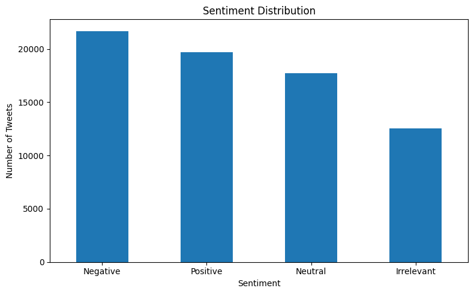
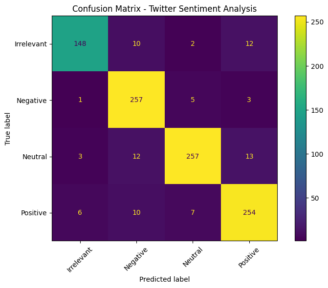

# 🐦 Twitter Sentiment Analysis using Machine Learning

A Natural Language Processing (NLP) and Machine Learning project that classifies Twitter posts based on their sentiment using **TF-IDF** and **Logistic Regression**.

The project preprocesses Twitter text, converts the text into numerical features using TF-IDF, trains a Logistic Regression model, evaluates its performance, and predicts sentiment for custom tweets.

## 📌 Project Overview
Sentiment Analysis is an NLP task used to identify the sentiment expressed in text.

In this project, Twitter data is classified into four sentiment categories:
- Positive
- Negative
- Neutral
- Irrelevant

The model is trained using the provided training dataset and evaluated using a separate validation dataset.

## 📊 Dataset
**Dataset:** Twitter Entity Sentiment Analysis
**Source:** [Kaggle](https://www.kaggle.com/datasets/jp797498e/twitter-entity-sentiment-analysis)

The dataset contains:
- ID
- Entity
- Sentiment
- Tweet

Two files are used in this project:
- `twitter_training.csv`
- `twitter_validation.csv`

## 🎯 Objectives
- Load and inspect Twitter sentiment data
- Handle missing values and duplicate records
- Analyze sentiment distribution
- Clean and preprocess tweet text
- Convert text into numerical features using TF-IDF
- Train a Logistic Regression model
- Evaluate the model using accuracy and classification report
- Analyze predictions using a confusion matrix
- Predict sentiment and confidence for custom tweets
- Save validation predictions to a CSV file

## 🛠️ Technologies Used
- Python
- Pandas
- Regular Expressions
- Matplotlib
- Scikit-learn
- TF-IDF
- Logistic Regression

## 🔄 Project Workflow
```
Twitter Dataset
       ↓
Load Training & Validation Data
       ↓
Data Cleaning
       ↓
Remove Missing & Duplicate Records
       ↓
Sentiment Distribution Analysis
       ↓
Text Preprocessing
       ↓
TF-IDF Vectorization
       ↓
Logistic Regression
       ↓
Sentiment Prediction
       ↓
Model Evaluation
       ↓
Confusion Matrix
       ↓
Custom Tweet Prediction
       ↓
Save Predictions
```

## 🧹 Data Cleaning
The project performs the following cleaning steps:
- Removes missing tweets and sentiment values
- Removes duplicate records
- Removes empty cleaned tweets

## ✨ Text Preprocessing
The tweet text is cleaned using a custom `clean_text()` function.

The preprocessing includes:
- Converting text to lowercase
- Removing URLs
- Removing user mentions
- Removing hashtag symbols
- Removing HTML tags
- Removing special characters
- Removing extra spaces

Example:
```
Original:
@user I LOVE this product!!! #Amazing

Cleaned:
i love this product amazing
```

## 🔢 TF-IDF Vectorization
TF-IDF (Term Frequency-Inverse Document Frequency) is used to convert tweet text into numerical features.

```python
TfidfVectorizer(
    max_features=20000,
    ngram_range=(1, 2),
    min_df=2,
    sublinear_tf=True
)
```

## 🤖 Machine Learning Model

### Logistic Regression
Logistic Regression is used as the classification algorithm for predicting the sentiment of tweets. The model is trained using the TF-IDF features generated from the training dataset.

```python
LogisticRegression(
    max_iter=1000
)
```

## 📈 Results
| Metric | Score |
|---|---|
| Accuracy | *(add after running)* |
| Macro F1-Score | *(add after running)* |
| Weighted F1-Score | *(add after running)* |

The classification report provides per-class precision, recall, and F1-score for Positive, Negative, Neutral, and Irrelevant categories.

## 📊 Visualizations

### Sentiment Distribution


### Confusion Matrix


## 💡 Key Insights
*(add 2-3 bullet points once you see the output — e.g. which sentiment class is hardest to predict, how balanced the dataset is)*

## 🧪 Custom Sentiment Prediction
The project includes a custom prediction function that accepts new text and predicts:
- Sentiment
- Prediction confidence

Example:
```
Tweet:
I absolutely love this product!

Predicted Sentiment:
Positive
```

## 💾 Output File
The project saves validation predictions into: `sentiment_predictions.csv`

The output contains:
- ID
- Entity
- Original Tweet
- Actual Sentiment
- Predicted Sentiment

## 🚀 How to Run
```bash
pip install -r requirements.txt
```
Keep the dataset files in the same folder:
```
twitter_training.csv
twitter_validation.csv
```
Open `sentiment-Analysis.ipynb` using Jupyter Notebook, JupyterLab, or Google Colab, and run all cells in order. The notebook will:
- Load the datasets
- Clean the data
- Preprocess the tweets
- Generate TF-IDF features
- Train the Logistic Regression model
- Evaluate the model
- Generate visualizations
- Make custom predictions
- Save prediction results

## 📁 Project Structure
```
Twitter-Sentiment-Analysis-using-Machine-Learning/
├── twitter_training.csv
├── twitter_validation.csv
├── sentiment-Analysis.ipynb
├── sentiment_predictions.csv
├── sentiment_distribution.png
├── confusion_matrix.png
├── README.md
└── requirements.txt
```

## 📚 Key Learning Outcomes
Through this project, I practiced:
- Natural Language Processing basics
- Text preprocessing
- TF-IDF feature extraction
- Logistic Regression classification
- Model evaluation
- Confusion matrix analysis
- Custom text prediction
- Working with Twitter data

## 👨‍💻 Author
**Adarsh Yadav**

GitHub: [github.com/Adarsh8158](https://github.com/Adarsh8158)
LinkedIn: [linkedin.com/in/adarsh-yadav-49225140](https://www.linkedin.com/in/adarsh-yadav-49225140/)
